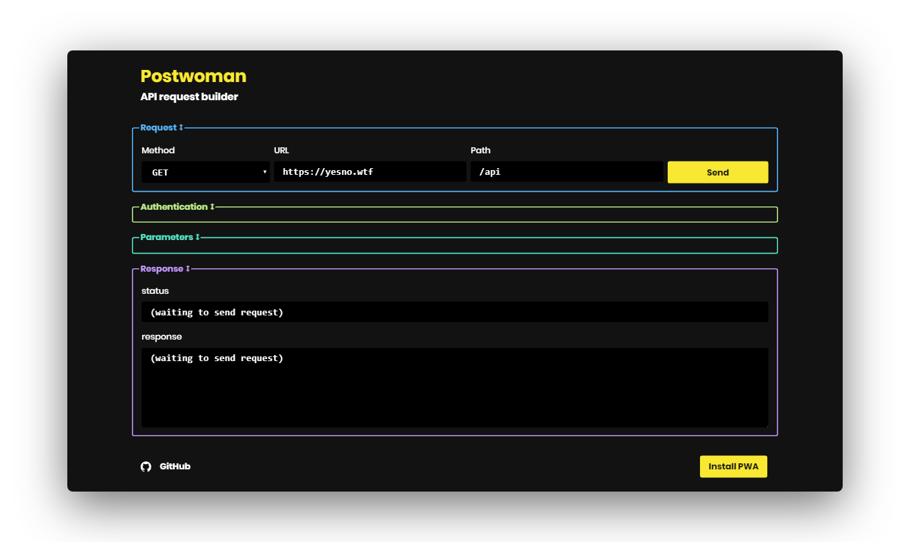
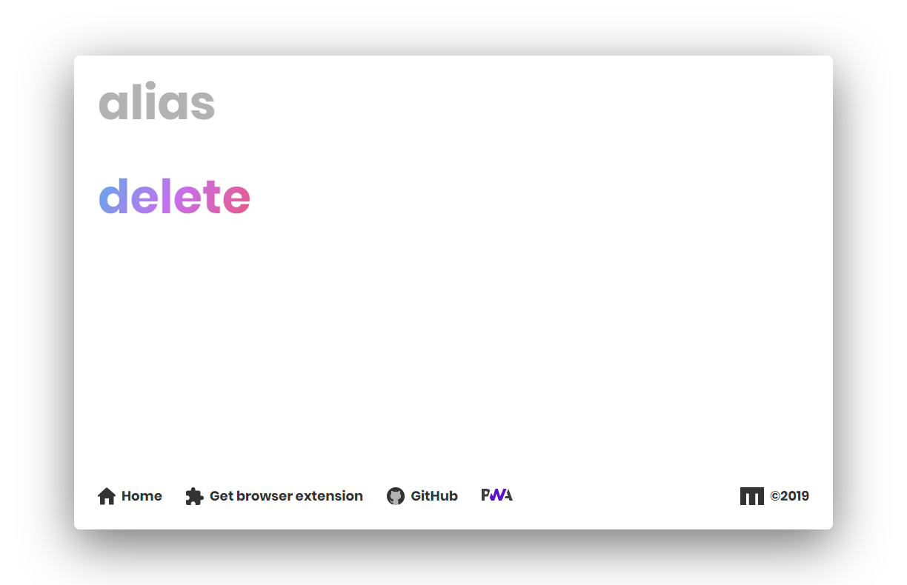

```
When I wrote this, only God and I understood what I was doing. Now, only God knows.
```
<div align="center">
  <a href="https://liyas-thomas.firebaseapp.com"></a>
  <br>
  <h1>Liyas Thomas</h1>
  <sub>Built with ❤︎ by
  <a href="https://github.com/liyasthomas">liyasthomas</a> and
  <a href="https://github.com/liyasthomas/banner/graphs/contributors">contributors</a>
	</sub>
</div>

---

[](https://travis-ci.org/liyasthomas/banner) [](https://github.com/liyasthomas/banner/releases/latest) [](https://github.com/liyasthomas/banner/archive/master.zip) [](https://github.com/liyasthomas/banner/blob/master/LICENSE) [](https://github.com/liyasthomas/banner/issues) [](https://liyas-thomas.firebaseapp.com) [](https://www.paypal.me/liyascthomas)

#  Banner

### 🚩 A simple and clean banner generator by [Liyas Thomas](https://github.com/liyasthomas)

<div align="center">
  <br>
  
  
  <br>
</div>

### Features :sparkles:

:heart: **Lightweight and minimal**: Crafted with minimalistic UI design

:electric_plug: **Real-time demo**: WYSIWYG (what you see is what you get) banner editor 

:zap: **Make it your own**: Customize everything!

:robot: **AI**: Generate combination colors for background and foreground

:sparkles: **Choose custom colors**: Randomize or choose your own colors

:rocket: **Save**: Download generated banner to disk

---

## Demo

[https://liyasthomas.github.io/banner](https://liyasthomas.github.io/banner)

1. Give a heading
2. Customize everything!
3. Download banner

You're done!

---

## Built with

* **[Chromium](https://github.com/chromium/chromium)** - Thanks for being so fast!
* HTML - For the web framework
* CSS - For styling components
* JavaScript - For magic!

---

## Contributing

Please read [CONTRIBUTING](CONTRIBUTING.md) for details on our [CODE OF CONDUCT](CODE_OF_CONDUCT.md), and the process for submitting pull requests to us.

---

## Continuous Integration

We use [Travis CI](https://travis-ci.com) for continuous integration. Check out our [Travis CI Status](https://travis-ci.org/liyasthomas/banner).

---

## Versioning

This project is developed by [Liyas Thomas](https://github.com/liyasthomas) using the [Semantic Versioning specification](https://semver.org). For the versions available, see the [releases on this repository](https://github.com/liyasthomas/banner/releases).

---

## Change log

See the [CHANGELOG](CHANGELOG.md) file for details.

---

## Authors

### Lead Developers
* [**Liyas Thomas**](https://github.com/liyasthomas) - *Author*

### Testing and Debugging
* [Liyas Thomas](https://github.com/liyasthomas)

### Contributors
* [Liyas Thomas](https://github.com/liyasthomas)

### Thanks
* [Dribbble](https://dribbble.com)

See the list of [contributors](https://github.com/liyasthomas/banner/graphs/contributors) who participated in this project.

---

## License

This project is licensed under the [MIT License](https://opensource.org/licenses/MIT) - see the [LICENSE](LICENSE) file for details.

---

## Acknowledgments

* Hat tip to anyone who's code was used
* Inspirations:
	* [Dribbble](https://dribbble.com)