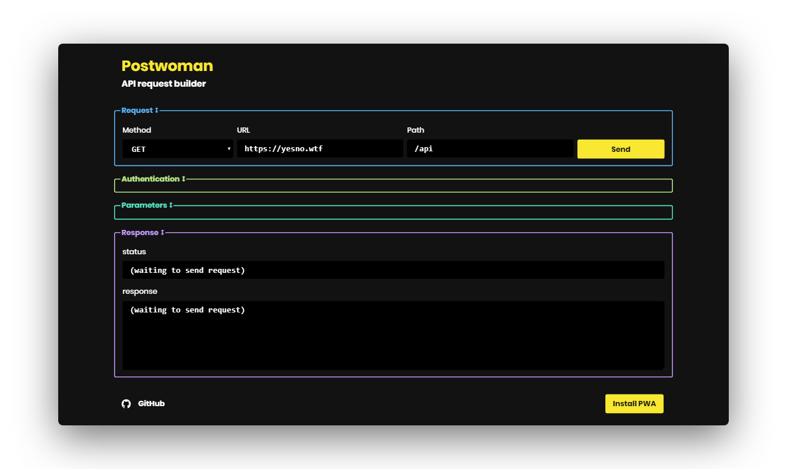
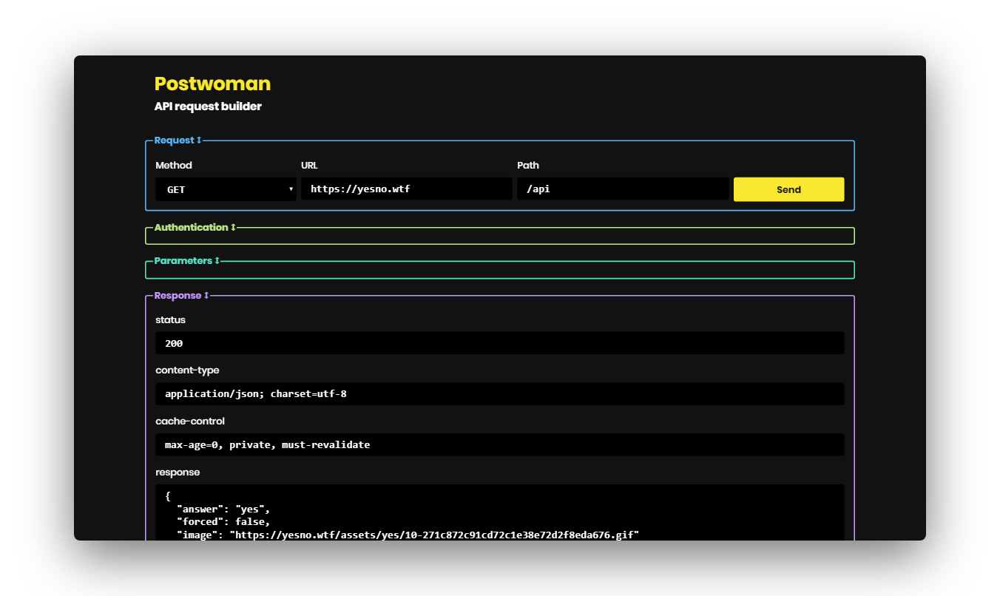

```
When I wrote this, only God and I understood what I was doing. Now, only God knows.
```
<div align="center">
    <a href="https://liyas-thomas.firebaseapp.com"></a>
    <br>
    <h1>Liyas Thomas</h1>
    <sub>Built with ❤︎ by
      <a href="https://github.com/liyasthomas">liyasthomas</a> and
      <a href="https://github.com/liyasthomas/postwoman/graphs/contributors">contributors</a>
    </sub>
</div>

---

[](https://travis-ci.org/liyasthomas/postwoman) [](https://github.com/liyasthomas/postwoman/releases/latest) [](https://github.com/liyasthomas/postwoman/archive/master.zip) [](https://github.com/liyasthomas/postwoman/blob/master/LICENSE) [](https://github.com/liyasthomas/postwoman/issues) [](https://liyas-thomas.firebaseapp.com) [](https://www.paypal.me/liyascthomas) [](https://www.buymeacoffee.com/liyasthomas)

#  Postwoman

### 👽 API request builder by [Liyas Thomas](https://github.com/liyasthomas)

<div align="center">
  <br>
  
  
  <br>
</div>

### Features :sparkles:

:heart: **Lightweight and minimal**: Crafted with minimalistic UI design

:electric_plug: **Real-time demo**: Send requests and get response right away!

:robot: **VIBGYOR**: Neon combination of colors for background and foreground

:sparkles: **PWA**: Install as a PWA on your device

---

## Demo

[https://liyasthomas.github.io/postwoman](https://liyasthomas.github.io/postwoman)

1. Specify your request method
2. Type in your API URL
3. Add API path
4. Send request
5. Get response!

You're done!

---

## Built with

* **[Chromium](https://github.com/chromium/chromium)** - Thanks for being so fast!
* HTML - For the web framework
* CSS - For styling components
* JavaScript - For magic!
* [Vue](https://vuejs.org/) - To add to the JavaScript magic!
* [Nuxt](https://nuxtjs.org/) - To add to the Vue magic! <!-- (Nuxt helps create the PWA and single page application.) -->

---

## Developing

1. [Clone this repo](https://help.github.com/en/articles/cloning-a-repository) with git.
1. Install dependencies by running `npm install` within the directory that you cloned (probably `postwoman`).
1. Start the development server with `npm run dev`.
1. Open development site by going to [http://localhost:3000](http://localhost:3000) in your browser.

---

## Releasing
1. [Clone this repo](https://help.github.com/en/articles/cloning-a-repository) with git.
1. Install dependencies by running `npm install` within the directory that you cloned (probably `postwoman`).
1. Build the release files with `npm run build`.
1. Find the built project in `./dist`.

---

## Contributing

Please read [CONTRIBUTING](CONTRIBUTING.md) for details on our [CODE OF CONDUCT](CODE_OF_CONDUCT.md), and the process for submitting pull requests to us.

---

## Continuous Integration

We use [Travis CI](https://travis-ci.com) for continuous integration. Check out our [Travis CI Status](https://travis-ci.org/liyasthomas/postwoman).

---

## Versioning

This project is developed by [Liyas Thomas](https://github.com/liyasthomas) using the [Semantic Versioning specification](https://semver.org). For the versions available, see the [releases on this repository](https://github.com/liyasthomas/postwoman/releases).

---

## Change log

See the [CHANGELOG](CHANGELOG.md) file for details.

---

## Authors

### Lead Developers
* [**Liyas Thomas**](https://github.com/liyasthomas) - *Author*

### Testing and Debugging
* [Liyas Thomas](https://github.com/liyasthomas)

### Contributors
* [NBTX](https://github.com/NBTX)
* [Andrew Bastin](https://github.com/AndrewBastin)
* [Nick Palenchar](https://github.com/nickpalenchar)
* [Abraham Williams](https://github.com/abraham)
* [Nicholas La Roux](https://github.com/larouxn)
* [RifqiAlAbqary](https://github.com/reefqi037)
* [izerozlu](https://github.com/izerozlu)

### Thanks
* [Dribbble](https://dribbble.com)

See the list of [contributors](https://github.com/liyasthomas/postwoman/graphs/contributors) who participated in this project.

---

## License

This project is licensed under the [MIT License](https://opensource.org/licenses/MIT) - see the [LICENSE](LICENSE) file for details.

---

## Acknowledgments

* Hat tip to anyone who's code was used
* Inspirations:
	* [Dribbble](https://dribbble.com)
