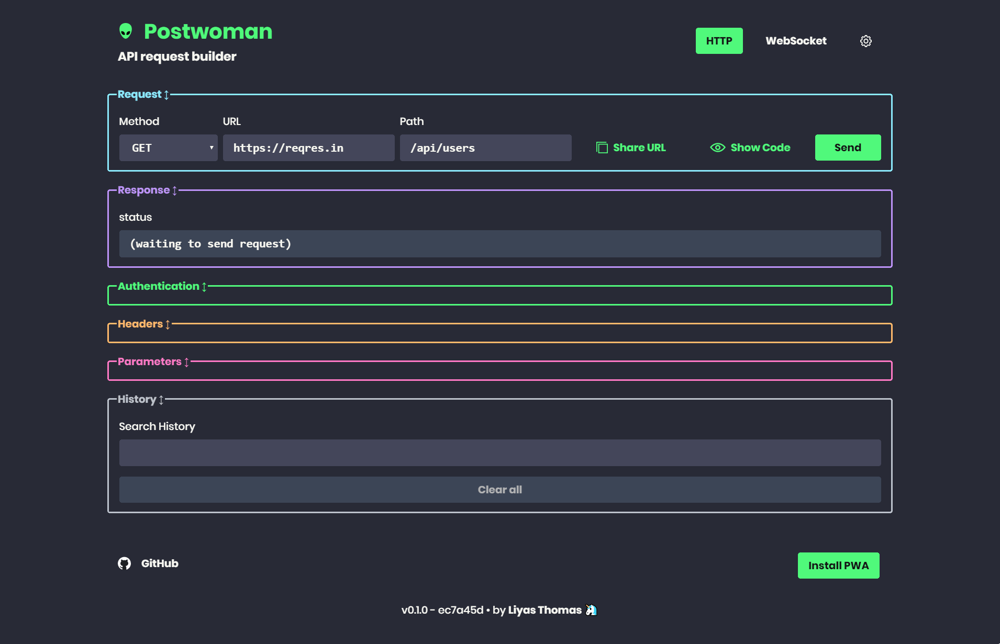
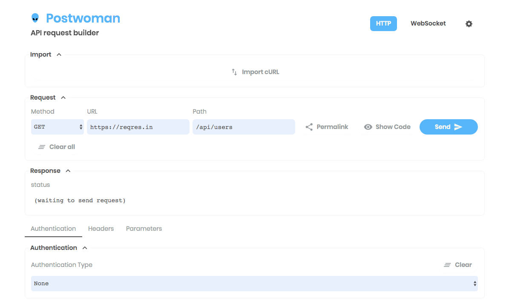

```
When I wrote this, only God and I understood what I was doing. Now, only God knows.
```
<div align="center">
    <a href="https://liyas-thomas.firebaseapp.com"></a>
    <br>
    <h1>Liyas Thomas</h1>
    <sub>Built with ❤︎ by
      <a href="https://github.com/liyasthomas">liyasthomas</a> and
      <a href="https://github.com/liyasthomas/postwoman/graphs/contributors">contributors</a>
    </sub>
</div>

---

[](https://travis-ci.com/liyasthomas/postwoman) [](https://github.com/liyasthomas/postwoman/releases/latest) [](https://github.com/liyasthomas/postwoman/archive/master.zip) [](https://github.com/liyasthomas/postwoman/blob/master/LICENSE) [](https://github.com/liyasthomas/postwoman/issues) [](https://liyas-thomas.firebaseapp.com) [](https://www.paypal.me/liyascthomas) [](https://www.buymeacoffee.com/liyasthomas)

#  Postwoman

### API request builder

**Start here: _[Story behind Postwoman](https://dev.to/liyasthomas/i-created-postwoman-an-online-open-source-api-request-builder-41md)_**

<div align="center">
  <br>
  
  
  <br>
</div>

### Features :sparkles:

:heart: **Lightweight**: Crafted with minimalistic UI design

 - Faster, lighter, cleaner, minimal & responsive

:zap: **Real-time**: Send requests and get/copy responses right away!

**Methods:**
 - `GET` - Retrieve information about the REST API resource
 - `HEAD` - Asks for a response identical to that of a GET request, but without the response body.
 - `POST` - Create a REST API resource
 - `PUT` - Update a REST API resource
 - `DELETE` - Delete a REST API resource or related component
 - `OPTIONS` - Describe the communication options for the target resource
 - `PATCH` - Applies partial modifications to a REST API resource

_History entries are synced with local session storage_

:rainbow: **VIBGYOR**: Neon combination background, foreground & accent colors - because customization === freedom :sparkles:

**Customizations:**
 - Dark and Light background themes
 - Choose accent color
 - Toggle multi-colored frames

_Customized themes are also synced with local session storage_

:fire: **PWA**: Install as a **[PWA](https://developers.google.com/web/progressive-web-apps)** on your device

**Features:**
 - Instant loading with Service Workers
 - Offline support
 - Low RAM/memory and CPU usage

:rocket: **Request**: Retrieve data from a URL without having to do a full page refresh

 - Choose `method`
 - Enter `URL`
 - Enter `Path`
 - Copy public "Share URL"
 - Generate request code for JavaScript XHR, Fetch, cURL
 - Copy generated request code to clipboard

:electric_plug: **Web Socket**: Establish full-duplex communication channels over a single TCP connection

 -  Send and receive data

:closed_lock_with_key: **Authentication**: Allows to identity the end user

**Types:**
 - None
 - Basic authentication using username and password
 - Token based authentication

:loudspeaker: **Headers**: Describes the format the body of your request is being sent as

:mailbox: **Parameters**: Use request parameters to set varying parts in simulated requests

:page_with_curl: **Request Body**: Used to send and receive data via the REST API

**Options:**
 - Set content Type
 - Toggle between RAW input and parameter list

:wave: **Responses**: Contains the status line, headers and the message/response body

 - Copy response to clipboard
 - View preview for HTML responses

_HTML responses have "Preview HTML" feature_

:alarm_clock: **History**: Request entries are synced with local session storage to reuse with a single click

**Fields**
 - Timestamp
 - Method
 - Status code
 - URL
 - Path

_History entries can be deleted one-by-one or all together_

---

## Demo

[https://postwoman.io](https://postwoman.io)

## Usage

1. Specify your request method
2. Type in your API URL
3. Add API path
4. Send request
5. Get response!

You're done!

---

## Built with

* **[Chromium](https://github.com/chromium/chromium)** - Thanks for being so fast!
* HTML - For the web framework
* CSS - For styling components
* JavaScript - For magic!
* [Vue](https://vuejs.org/) - To add to the JavaScript magic!
* [Nuxt](https://nuxtjs.org/) - To add to the Vue magic! <!-- (Nuxt helps create the PWA and single page application.) -->

---

## Developing

1. [Clone this repo](https://help.github.com/en/articles/cloning-a-repository) with git.
1. Install dependencies by running `npm install` within the directory that you cloned (probably `postwoman`).
1. Start the development server with `npm run dev`.
1. Open development site by going to [http://localhost:3000](http://localhost:3000) in your browser.

---

## Releasing
1. [Clone this repo](https://help.github.com/en/articles/cloning-a-repository) with git.
1. Install dependencies by running `npm install` within the directory that you cloned (probably `postwoman`).
1. Build the release files with `npm run build`.
1. Find the built project in `./dist`.

---

## Contributing

Please read [CONTRIBUTING](CONTRIBUTING.md) for details on our [CODE OF CONDUCT](CODE_OF_CONDUCT.md), and the process for submitting pull requests to us.

---

## Continuous Integration

We use [Travis CI](https://travis-ci.com) for continuous integration. Check out our [Travis CI Status](https://travis-ci.com/liyasthomas/postwoman).

---

## Versioning

This project is developed by [Liyas Thomas](https://github.com/liyasthomas) using the [Semantic Versioning specification](https://semver.org). For the versions available, see the [releases on this repository](https://github.com/liyasthomas/postwoman/releases).

---

## Change log

See the [CHANGELOG](CHANGELOG.md) file for details.

---

## Authors

### Lead Developers
* [**Liyas Thomas**](https://github.com/liyasthomas) - *Author*

### Testing and Debugging
* [Liyas Thomas](https://github.com/liyasthomas)
* ([contributors](https://github.com/liyasthomas/postwoman/graphs/contributors))

### Contributors

<!-- ALL-CONTRIBUTORS-LIST:START - Do not remove or modify this section -->
<!-- prettier-ignore -->
<table>
  <tr>
    <td align="center"><a href="https://github.com/NBTX"><br /><sub><b>John Harker</b></sub></a><br /><a href="https://github.com/liyasthomas/postwoman/commits?author=NBTX" title="Code">💻</a></td>
  </tr>
</table>

<!-- ALL-CONTRIBUTORS-LIST:END -->

### Thanks
* [Dribbble](https://dribbble.com)

See the list of [contributors](https://github.com/liyasthomas/postwoman/graphs/contributors) who participated in this project.

---

## License

This project is licensed under the [MIT License](https://opensource.org/licenses/MIT) - see the [LICENSE](LICENSE) file for details.

---

## Acknowledgments

* Hat tip to anyone who's code was used
* Inspirations:
	* [Dribbble](https://dribbble.com)
