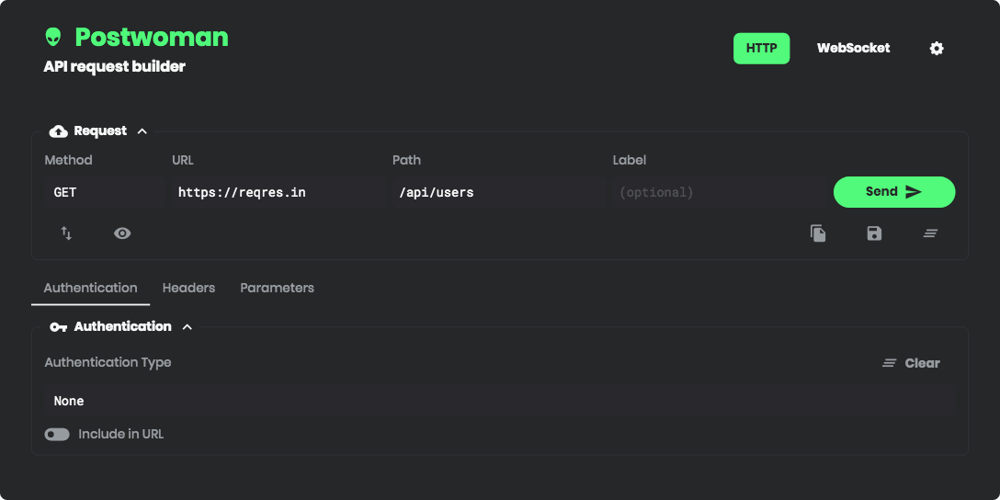

```
When I wrote this, only God and I understood what I was doing. Now, only God knows.
```

<div align="center">
  <a href="https://liyas-thomas.firebaseapp.com"></a>
  <br>
  <h1><a href="https://postwoman.io">Postwoman.io</a></h1>
  <p>
    API request builder - Helps you create your requests faster, saving you precious time on your development - <a href="https://postwoman.launchaco.com">Subscribe</a>
  </p>
<p>

[](https://travis-ci.com/liyasthomas/postwoman) [](https://github.com/liyasthomas/postwoman/releases/latest) [](CONTRIBUTING.md) [](https://postwoman.io) [](https://opencollective.com/postwoman) [](https://www.paypal.me/liyascthomas) [](https://t.me/postwoman_app) [](https://discord.gg/GAMWxmR)

</p>
  <sub>Built with ❤︎ by
    <a href="https://github.com/liyasthomas">liyasthomas</a> and
    <a href="https://github.com/liyasthomas/postwoman/graphs/contributors">contributors</a>
  </sub>
</div>

---

**Start here: _[Story behind Postwoman](https://dev.to/liyasthomas/i-created-postwoman-an-online-open-source-api-request-builder-41md)_**

**Chat here: _[Telegram](https://t.me/postwoman_app), [Discord](https://discord.gg/GAMWxmR)_**

**Donate here: _[PayPal](https://www.paypal.me/liyascthomas), [Open Collective](https://opencollective.com/postwoman), [Patreon](https://www.patreon.com/liyasthomas)_**

<div align="center">
  <br>
  
  <br>
</div>

### Features ✨

❤️ **Lightweight**: Crafted with minimalistic UI design. Simple design is the best design.

 - Faster, lighter, cleaner, minimal & responsive

⚡️ **Fast**: Send requests and get/copy responses in real-time! Fast software is the best software.

**Methods:**
 - `GET` - Retrieve information about the REST API resource
 - `HEAD` - Asks for a response identical to that of a GET request, but without the response body.
 - `POST` - Create a REST API resource
 - `PUT` - Update a REST API resource
 - `DELETE` - Delete a REST API resource or related component
 - `OPTIONS` - Describe the communication options for the target resource
 - `PATCH` - Applies partial modifications to a REST API resource

_History entries are synced with local session storage_

🌈 **Make it yours**: Customizable combinations for background, foreground and accent colors: because customization === freedom. [Customize now ✨](https://postwoman.io/settings).

**Customizations:**
 - Choose theme: Kinda Dark (default), Clearly White, Just Black and System theme
 - Choose accent color: Green (default), Yellow, Pink, Red, Purple, Orange, Cyan and Blue
 - Toggle multi-colored frames

_Customized themes are also synced with local session storage_

🔥 **PWA**: Install as a **[PWA](https://developers.google.com/web/progressive-web-apps)** on your device.

**Features:**
 - Instant loading with [Service Workers](https://developers.google.com/web/fundamentals/primers/service-workers)
 - Offline support
 - Low RAM/memory and CPU usage
 - [Add to Home Screen](https://developers.google.com/web/fundamentals/app-install-banners) (button in footer)
 - [Desktop PWA](https://developers.google.com/web/progressive-web-apps/desktop) support (button in footer)
 - [Full features](https://developers.google.com/web/progressive-web-apps)

🚀 **Request**: Retrieve data from a URL without having to do a full page refresh.

 - Choose `method`
 - Enter `URL`
 - Enter `Path`

**Features:**
 - Copy/share public "Share URL"
 - Generate request code for JavaScript XHR, Fetch and cURL
 - Copy generated request code to clipboard
 - Import cURL
 - Label requests

🔌 **Web Socket**: Establish full-duplex communication channels over a single TCP connection.

 -  Send and receive data

🔐 **Authentication**: Allows to identity the end user.

**Types:**
 - None
 - Basic authentication using username and password
 - Token based authentication

📢 **Headers**: Describes the format the body of your request is being sent as.

 - Add or remove Header list

📫 **Parameters**: Use request parameters to set varying parts in simulated requests.

📃 **Request Body**: Used to send and receive data via the REST API.

**Options:**
 - Set Content Type
 - Add or remove Parameter list
 - Toggle between key-value and RAW input Parameter list

👋 **Responses**: Contains the status line, headers and the message/response body.

 - Copy response to clipboard
 - View preview for HTML responses

_HTML responses have "Preview HTML" feature_

⏰ **History**: Request entries are synced with local session storage to reuse with a single click.

**Fields**
 - Label
 - Timestamp
 - Method
 - Status code
 - URL
 - Path

_History entries can be sorted by any fields_

_Histories can deleted one-by-one or all together_

## Demo 🚀

[https://postwoman.io](https://postwoman.io)

## Usage 💡

1. Specify your request method
2. Type in your API URL
3. Add API path
4. Send request
5. Get response!

You're done!

## Built with 🔧

* [Chromium](https://github.com/chromium/chromium) - Thanks for being so fast!
* HTML - For the web framework
* CSS - For styling components
* JavaScript - For magic!
* [Vue](https://vuejs.org/) - To add to the JavaScript magic!
* [Nuxt](https://nuxtjs.org/) - To add to the Vue magic!

## Developing 👷

1. [Clone this repo](https://help.github.com/en/articles/cloning-a-repository) with git.
1. Install dependencies by running `npm install` within the directory that you cloned (probably `postwoman`).
1. Start the development server with `npm run dev`.
1. Open development site by going to [http://localhost:3000](http://localhost:3000) in your browser.

#### Or, with docker-compose:

1. [Clone this repo](https://help.github.com/en/articles/cloning-a-repository) with git.
1. Run `docker-compose up`
1. Open development site by going to [http://localhost:3000](http://localhost:3000) in your browser.

## Docker 🐳

```bash
#pull
docker pull liyasthomas/postwoman

#run
docker run -p 3000:3000 liyasthomas/postwoman:latest

#build
docker build -t postwoman:latest
```

## Releasing 🏷️

1. [Clone this repo](https://help.github.com/en/articles/cloning-a-repository) with git.
1. Install dependencies by running `npm install` within the directory that you cloned (probably `postwoman`).
1. Build the release files with `npm run build`.
1. Find the built project in `./dist`.


## Contributing 🍰

Please read [CONTRIBUTING](CONTRIBUTING.md) for details on our [CODE OF CONDUCT](CODE_OF_CONDUCT.md), and the process for submitting pull requests to us.

## Continuous Integration 💚

We use [Travis CI](https://travis-ci.com) for continuous integration. Check out our [Travis CI Status](https://travis-ci.com/liyasthomas/postwoman).

## Versioning 🔖

This project is developed by [Liyas Thomas](https://github.com/liyasthomas) using the [Semantic Versioning specification](https://semver.org). For the versions available, see the [releases on this repository](https://github.com/liyasthomas/postwoman/releases).

## Change log 📝

See the [CHANGELOG](CHANGELOG.md) file for details.

## Authors 🔮

### Lead Developers

* **[Liyas Thomas](https://github.com/liyasthomas)** - *Author*

### Testing and Debugging

* ([contributors](https://github.com/liyasthomas/postwoman/graphs/contributors))

### Collaborators

<table>
  <tr>
    <td align="center"><a href="https://github.com/NBTX"><br /><sub><b>John Harker</b></sub></a><br /><a href="https://github.com/liyasthomas/postwoman/commits?author=NBTX" title="Code">💻</a></td>
    <td align="center"><a href="https://github.com/izerozlu"><br /><sub><b>izerozlu</b></sub></a><br /><a href="https://github.com/liyasthomas/postwoman/commits?author=izerozlu" title="Code">💻</a></td>
    <td align="center"><a href="https://github.com/AndrewBastin"><br /><sub><b>Andrew Bastin</b></sub></a><br /><a href="https://github.com/liyasthomas/postwoman/commits?author=AndrewBastin" title="Code">💻</a></td>
    <td align="center"><a href="https://github.com/nickpalenchar"><br /><sub><b>Nick Palenchar</b></sub></a><br /><a href="https://github.com/liyasthomas/postwoman/commits?author=nickpalenchar" title="Code">💻</a></td>
    <td align="center"><a href="https://github.com/yubathom"><br /><sub><b>Thomas Yuba</b></sub></a><br /><a href="https://github.com/liyasthomas/postwoman/commits?author=yubathom" title="Code">💻</a></td>
    <td align="center"><a href="https://github.com/larouxn"><br /><sub><b>Nicholas La Roux</b></sub></a><br /><a href="https://github.com/liyasthomas/postwoman/commits?author=larouxn" title="Code">💻</a></td>
    <td align="center"><a href="https://github.com/JacobAnavisca"><br /><sub><b>Jacob Anavisca</b></sub></a><br /><a href="https://github.com/liyasthomas/postwoman/commits?author=JacobAnavisca" title="Code">💻</a></td>
  </tr>
  <tr>
    <td align="center"><a href="https://github.com/nityanandagohain"><br /><sub><b>Nityananda Gohain</b></sub></a><br /><a href="https://github.com/liyasthomas/postwoman/commits?author=nityanandagohain" title="Code">💻</a></td>
    <td align="center"><a href="https://github.com/terranblake"><br /><sub><b>Terran Blake</b></sub></a><br /><a href="https://github.com/liyasthomas/postwoman/commits?author=terranblake" title="Code">💻</a></td>
    <td align="center"><a href="https://github.com/hosseinnedaee"><br /><sub><b>Hossein Nedaee</b></sub></a><br /><a href="https://github.com/liyasthomas/postwoman/commits?author=hosseinnedaee" title="Code">💻</a></td>
  </tr>
</table>

See the list of [contributors](https://github.com/liyasthomas/postwoman/graphs/contributors) who participated in this project.

### Thanks

* [dev.to](https://dev.to)

## Contributors 🚸

### Code Contributors

This project exists thanks to all the people who contribute. [[Contribute](CONTRIBUTING.md)].

<a href="https://github.com/liyasthomas/postwoman/graphs/contributors"></a>

### Financial Contributors

Become a financial contributor and help us sustain our community. [[Contribute](https://opencollective.com/postwoman/contribute)]

#### Individuals

<a href="https://opencollective.com/postwoman"></a>

#### Organizations

Support this project with your organization. Your logo will show up here with a link to your website. [[Contribute](https://opencollective.com/postwoman/contribute)]

<a href="https://opencollective.com/postwoman/organization/0/website"></a>
<a href="https://opencollective.com/postwoman/organization/1/website"></a>
<a href="https://opencollective.com/postwoman/organization/2/website"></a>
<a href="https://opencollective.com/postwoman/organization/3/website"></a>
<a href="https://opencollective.com/postwoman/organization/4/website"></a>
<a href="https://opencollective.com/postwoman/organization/5/website"></a>
<a href="https://opencollective.com/postwoman/organization/6/website"></a>
<a href="https://opencollective.com/postwoman/organization/7/website"></a>
<a href="https://opencollective.com/postwoman/organization/8/website"></a>
<a href="https://opencollective.com/postwoman/organization/9/website"></a>

## License 📄

This project is licensed under the [MIT License](https://opensource.org/licenses/MIT) - see the [LICENSE](LICENSE) file for details.

## Acknowledgments 🙏

* Hat tip to anyone who's code was used
* Inspirations:
	* [Dribbble](https://dribbble.com)

<div align="center">
    <a href="https://liyas-thomas.firebaseapp.com"></a>
    <br>
    <h3>Happy Coding ❤︎</h3>
</div>
