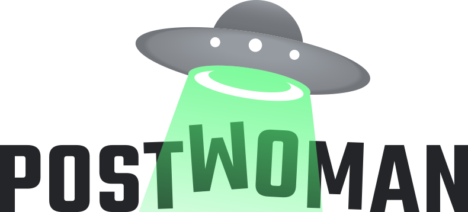
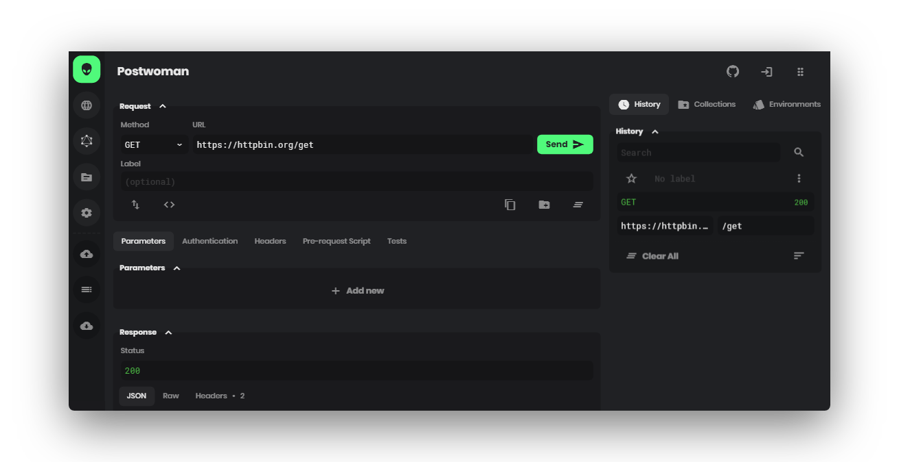

<div align="center">
  <a href="https://postwoman.io"></a>
  <br>
  <br>
  <p>
    <b>A free, fast and beautiful API request builder</b>
  </p>
  <p>
     <i>Web alternative to Postman - Helps you create requests faster, saving precious time on development - <a href="https://postwoman.launchaco.com">Subscribe</a></i>
  </p>
  <p>

  [](https://travis-ci.com/liyasthomas/postwoman) [](https://github.com/liyasthomas/postwoman/releases/latest) [](https://postwoman.io) [](CONTRIBUTING.md) [](https://opencollective.com/postwoman) [](https://www.paypal.me/liyascthomas) [](https://t.me/postwoman_app) [](https://discord.gg/GAMWxmR) [](https://twitter.com/intent/tweet?url=https%3A%2F%2Fpostwoman.io&text=%F0%9F%91%BD%20Postwoman%20%E2%80%A2%20API%20request%20builder%20-%20Helps%20you%20create%20your%20requests%20faster%2C%20saving%20you%20precious%20time%20on%20your%20development&original_referer=https%3A%2F%2Ftwitter.com%2Fshare%3Ftext%3D%25F0%259F%2591%25BD%2520Postwoman%2520%25E2%2580%25A2%2520API%2520request%2520builder%2520-%2520Helps%2520you%2520create%2520your%2520requests%2520faster%2C%2520saving%2520you%2520precious%2520time%2520on%2520your%2520development%26url%3Dhttps%3A%2F%2Fpostwoman.io%26hashtags%3Dpostwoman%26via%3Dliyasthomas&via=liyasthomas&hashtags=postwoman)

  </p>
  <p>
    <sub>Built with ❤︎ by
      <a href="https://github.com/liyasthomas">liyasthomas</a> and
      <a href="https://github.com/liyasthomas/postwoman/graphs/contributors">contributors</a>
    </sub>
  </p>
</div>

---

**Read: _[Story behind Postwoman](https://dev.to/liyasthomas/i-created-postwoman-an-online-open-source-api-request-builder-41md), [Postwoman v1.0](https://dev.to/liyasthomas/postwoman-v1-0-a-free-fast-beautiful-alternative-to-postman-mn0)_**

**Chat: _[Telegram](https://t.me/postwoman_app), [Discord](https://discord.gg/GAMWxmR)_**

**Donate: _[PayPal](https://www.paypal.me/liyascthomas), [Open Collective](https://opencollective.com/postwoman), [Patreon](https://www.patreon.com/liyasthomas)_**

<div align="center">
  <br>
  
  <br>
</div>

### Features ✨

❤️ **Lightweight**: Crafted with minimalistic UI design - simple design is the best design.

⚡️ **Fast**: Send requests and get/copy responses in real-time - fast software is the best software.

**Methods:**
 - `GET` - Retrieve information about the REST API resource
 - `HEAD` - Retrieve response headers identical to those of a GET request, but without the response body.
 - `POST` - Create a REST API resource
 - `PUT` - Update a REST API resource
 - `DELETE` - Delete a REST API resource or related component
 - `CONNECT` - Establishes a tunnel to the server identified by the target resource
 - `OPTIONS` - Describe the communication options for the target resource
 - `TRACE` - Performs a message loop-back test along the path to the target resource
 - `PATCH` - Apply partial modifications to a REST API resource
 - `<custom>` - Some APIs use custom request methods such as `LIST`. Type in your custom methods.

🌈 **Make it yours**: Customizable combinations for background, foreground and accent colors: because customization is freedom. [Customize now ✨](https://postwoman.io/settings).

**Customizations:**
 - Choose theme: Kinda Dark (default), Clearly White, Just Black and System theme
 - Choose accent color: Green (default), Yellow, Pink, Red, Purple, Orange, Cyan and Blue
 - Toggle multi-colored headings

_Customized themes are synced with local session storage_

🔥 **PWA**: Install as a [PWA](https://developers.google.com/web/progressive-web-apps) on your device.

**Features:**
 - Instant loading with [Service Workers](https://developers.google.com/web/fundamentals/primers/service-workers)
 - Offline support
 - Low RAM/memory and CPU usage
 - Add to Home Screen
 - Desktop PWA
 - ([full features](https://developers.google.com/web/progressive-web-apps))

🚀 **Request**: Retrieve response from endpoint instantly.

 - Choose `method`
 - Enter `URL` and `Path`
 - Send

**Features:**
 - Copy/share public "Share URL"
 - Generate request code for `JavaScript XHR`, `Fetch` and `cURL`
 - Copy generated request code to clipboard
 - Import `cURL`
 - Label requests

🔌 **WebSocket**: Establish full-duplex communication channels over a single TCP connection.

 - Send and receive data
 - Basic and Bearer Token authentication

📡 **Server Sent Events**: Receive a stream of updates from a server over a HTTP connection without resorting to polling.

🌩 **Socket.IO**: Send and Receive data with socketio server. SocketIO is popular websocket solution.

🔮 **GraphQL**: GraphQL is a query language for APIs and a runtime for fulfilling those queries with your existing data.

 - Set endpoint and get schemas
 - Multi-column docs
 - Set custom request headers
 - Query schema
 - Get query response

🔐 **Authentication**: Allows to identify the end user.

**Types:**
 - None
 - Basic
 - Bearer Token
 - OAuth 2.0
 - OIDC Access Token/PKCE (Proof Key for Code Exchange)

📢 **Headers**: Describes the format the body of your request is being sent as.

 - Add or remove Header list

📫 **Parameters**: Use request parameters to set varying parts in simulated requests.

📃 **Request Body**: Used to send and receive data via the REST API.

**Options:**
 - Set `Content Type`
 - Add or remove Parameter list
 - Toggle between key-value and RAW input Parameter list

👋 **Responses**: Contains the status line, headers and the message/response body.

 - Copy response to clipboard
 - Download response to as a file
 - View preview of HTML responses

⏰ **History**: Request entries are synced with local session storage to reuse with a single click.

**Fields:**
 - Star
 - Label
 - Method
 - Status code
 - URL
 - Path
 - Timestamp
 - Duration
 - Pre-request script

_History entries can be sorted by any fields_

_Histories can be deleted one-by-one or all together_

📁 **Collections**: Keep your API requests organized with collections and folders. Reuse them with a single click.

**Options:**
 - Create infinite collections, folders and requests
 - Edit, delete, move, export, import and replace

_Collections are synced with local session storage_

🌐 **Proxy**: Enable Proxy Mode from Settings to access blocked APIs.

**Features:**
 - Hide your IP address
 - Fixes [CORS](https://developer.mozilla.org/en-US/docs/Web/HTTP/CORS) (Cross Origin Resource Sharing) issues
 - Access APIs served in non-HTTPS (`http://`)
 - Use custom Proxy URL

_Official Postwoman Proxy is hosted by Apollo Software - **[Privacy Policy](https://apollosoftware.xyz/legal/postwoman)**_

📜 **Pre-Request Scripts β**: Snippets of code associated with a request that are executed before the request is sent.

**Use-cases:**
 - Include timestamp in the request headers
 - Send a random alphanumeric string in the URL parameters

_Requests with Pre-Request Scripts are indicated in History entries_

📄 **API Documentation**: Create and share dynamic API documentation easily, quickly.

**Usage:**
 1. Add your requests to Collections and Folders
 2. Export Collections and easily share your APIs with the rest of your team
 3. Import Collections and Generate Documentation on-the-go

⌨️ **Keyboard Shortcuts**: Optimized for efficiency.

**Shortcuts:**
 - Send Request <kbd>Ctrl</kbd> + <kbd>G</kbd>
 - Save to Collections <kbd>Ctrl</kbd> + <kbd>S</kbd>
 - Copy Request Link <kbd>Ctrl</kbd> + <kbd>K</kbd>
 - Reset Request <kbd>Ctrl</kbd> + <kbd>L</kbd>

🌎 **i18n β**: Experience the app in your own language.

 1. Scroll down to the footer
 2. Click "Choose Language" icon button
 3. Select your language from the menu

_Keep in mind: Translations aren't available for all source and target language combinations_

**To provide a localized experience for users around the world, you can add you own translations.**

_**All `i18n` contributions are welcome to `i18n` [branch](https://github.com/liyasthomas/postwoman/tree/i18n) only!**_

📦 **Add-ons**: Official add-ons for Postwoman.

 - **[Proxy β](https://github.com/postwoman-io/postwoman-proxy)** - A simple proxy server created for Postwoman
 - **[CLI β](https://github.com/postwoman-io/postwoman-cli)** - A CLI solution for Postwoman
 - **Browser Extensions** - Browser extensions that simplifies access to Postwoman

   [ **Firefox**](https://addons.mozilla.org/en-US/firefox/addon/postwoman) &nbsp;|&nbsp; [ **Chrome**](https://chrome.google.com/webstore/detail/postwoman-extension-for-c/amknoiejhlmhancpahfcfcfhllgkpbld) ([GitHub](https://github.com/AndrewBastin/postwoman-extension))

   >**Extensions fixes `CORS` issues.**

_Add-ons are developed and maintained under **[Official Postwoman Organization](https://github.com/postwoman-io)**._

☁️ **Auth + Sync**: Sign in and sync in real-time.

**Sign in with:**
 - Google
 - GitHub

**Sync:**
 - History
 - Collections

✅ **Post-Request Tests β**: Write tests associated with a request that are executed after the request response.

**Use-cases:**
 - Check the status code as an integer
 - Filter response headers
 - Parse the response data

**To find out more, please check out [Postwoman Wiki](https://github.com/liyasthomas/postwoman/wiki).**

## Demo 🚀 [](https://postwoman.io)

[postwoman.io](https://postwoman.io)

<a href="https://www.netlify.com">
  
</a>

## Usage 💡

1. Specify your request `method`
2. Type in your API `URL` and `path`
3. Send request
4. Get response

You're done!

## Built with 🔧

* [Chromium](https://github.com/chromium/chromium) - Thanks for being so fast!
* HTML - For the web framework
* CSS - For styling components
* JavaScript - For magic!
* [Vue](https://vuejs.org/) - To add to the JavaScript magic!
* [Nuxt](https://nuxtjs.org/) - To add to the Vue magic!

## Developing 👷

#### Use a browser based development environment:

[](https://gitpod.io/#https://github.com/liyasthomas/postwoman)

#### Or, with local development environment:

1. [Clone this repo](https://help.github.com/en/articles/cloning-a-repository) with git.
2. Install dependencies by running `npm install` within the directory that you cloned (probably `postwoman`).
3. Start the development server with `npm run dev`.
4. Open development site by going to [http://localhost:3000](http://localhost:3000) in your browser.

#### Or, with docker-compose:

1. [Clone this repo](https://help.github.com/en/articles/cloning-a-repository) with git.
2. Run `docker-compose up`
3. Open development site by going to [http://localhost:3000](http://localhost:3000) in your browser.

## Docker 🐳 [](https://hub.docker.com/r/liyasthomas/postwoman)

```bash
#pull
docker pull liyasthomas/postwoman

#run
docker run -p 3000:3000 liyasthomas/postwoman:latest

#build
docker build -t postwoman:latest
```

## Releasing 🏷️

1. [Clone this repo](https://help.github.com/en/articles/cloning-a-repository) with git.
2. Install dependencies by running `npm install` within the directory that you cloned (probably `postwoman`).
3. Build the release files with `npm run build`.
4. Find the built project in `./dist`.

## Contributing 🍰

Please read [CONTRIBUTING](CONTRIBUTING.md) for details on our [CODE OF CONDUCT](CODE_OF_CONDUCT.md), and the process for submitting pull requests to us.

## Continuous Integration 💚 [](https://travis-ci.com/liyasthomas/postwoman)

We use [Travis CI](https://travis-ci.com) for continuous integration. Check out our [Travis CI Status](https://travis-ci.com/liyasthomas/postwoman).

## Versioning 🔖 [](https://github.com/liyasthomas/postwoman/releases/latest)

This project is developed by [Liyas Thomas](https://github.com/liyasthomas) using the [Semantic Versioning specification](https://semver.org). For the versions available, see the [releases on this repository](https://github.com/liyasthomas/postwoman/releases).

## Change log 📝

See the [CHANGELOG](CHANGELOG.md) file for details.

## Authors 🔮

### Lead Developers

* **[Liyas Thomas](https://github.com/liyasthomas)** - *Author*
* **[John Harker](https://github.com/NBTX)** - *Lead developer*
* **[Andrew Bastin](https://github.com/andrewbastin)** - *Lead developer*
* **[James George](https://github.com/jamesgeorge007)** - *Lead maintainer*
* **[Caneco](https://twitter.com/caneco)** - *Logo and banner designer*

### Testing and Debugging

* ([contributors](https://github.com/liyasthomas/postwoman/graphs/contributors))

### Collaborators <!-- ALL-CONTRIBUTORS-BADGE:START - Do not remove or modify this section -->
[](#contributors-)
<!-- ALL-CONTRIBUTORS-BADGE:END -->

<!-- ALL-CONTRIBUTORS-LIST:START - Do not remove or modify this section -->
<!-- prettier-ignore-start -->
<!-- markdownlint-disable -->
<table>
  <tr>
    <td align="center"><a href="https://liyasthomas.web.app"><br /><sub><b>Liyas Thomas</b></sub></a><br /><a href="https://github.com/liyasthomas/postwoman/commits?author=liyasthomas" title="Code">💻</a> <a href="#design-liyasthomas" title="Design">🎨</a></td>
    <td align="center"><a href="https://github.com/NBTX"><br /><sub><b>John Harker</b></sub></a><br /><a href="https://github.com/liyasthomas/postwoman/commits?author=NBTX" title="Code">💻</a> <a href="#design-NBTX" title="Design">🎨</a></td>
    <td align="center"><a href="https://nicholaslaroux.com"><br /><sub><b>Nicholas La Roux</b></sub></a><br /><a href="https://github.com/liyasthomas/postwoman/commits?author=larouxn" title="Code">💻</a></td>
    <td align="center"><a href="https://github.com/yubathom"><br /><sub><b>Thomas Yuba</b></sub></a><br /><a href="https://github.com/liyasthomas/postwoman/commits?author=yubathom" title="Code">💻</a></td>
    <td align="center"><a href="http://www.linkedin.com/in/nickpalenchar"><br /><sub><b>Nick Palenchar</b></sub></a><br /><a href="https://github.com/liyasthomas/postwoman/commits?author=nickpalenchar" title="Code">💻</a></td>
    <td align="center"><a href="https://github.com/AndrewBastin"><br /><sub><b>Andrew Bastin</b></sub></a><br /><a href="https://github.com/liyasthomas/postwoman/commits?author=AndrewBastin" title="Code">💻</a></td>
    <td align="center"><a href="https://github.com/vlad0337187"><br /><sub><b>Vladislav</b></sub></a><br /><a href="https://github.com/liyasthomas/postwoman/commits?author=vlad0337187" title="Code">💻</a></td>
  </tr>
  <tr>
    <td align="center"><a href="https://github.com/izerozlu"><br /><sub><b>izerozlu</b></sub></a><br /><a href="https://github.com/liyasthomas/postwoman/commits?author=izerozlu" title="Code">💻</a></td>
    <td align="center"><a href="https://github.com/JacobAnavisca"><br /><sub><b>Jacob Anavisca</b></sub></a><br /><a href="https://github.com/liyasthomas/postwoman/commits?author=JacobAnavisca" title="Code">💻</a></td>
    <td align="center"><a href="http://nityanandagohain.github.io"><br /><sub><b>Nityananda Gohain</b></sub></a><br /><a href="https://github.com/liyasthomas/postwoman/commits?author=nityanandagohain" title="Code">💻</a></td>
    <td align="center"><a href="https://github.com/hosseinnedaee"><br /><sub><b>Hossein Nedaee</b></sub></a><br /><a href="https://github.com/liyasthomas/postwoman/commits?author=hosseinnedaee" title="Code">💻</a></td>
    <td align="center"><a href="https://ghuser.io/jamesgeorge007"><br /><sub><b>James George</b></sub></a><br /><a href="https://github.com/liyasthomas/postwoman/commits?author=jamesgeorge007" title="Code">💻</a></td>
    <td align="center"><a href="https://dmitryyankowski.com"><br /><sub><b>Dmitry Yankowski</b></sub></a><br /><a href="https://github.com/liyasthomas/postwoman/commits?author=dmitryyankowski" title="Code">💻</a></td>
  </tr>
</table>

<!-- markdownlint-enable -->
<!-- prettier-ignore-end -->
<!-- ALL-CONTRIBUTORS-LIST:END -->

See the list of [contributors](https://github.com/liyasthomas/postwoman/graphs/contributors) who participated in this project.

### Thanks

* [dev.to 👩‍💻👨‍💻](https://dev.to)

### Financial Contributors

Become a financial contributor and help us sustain our community. [[Contribute](https://opencollective.com/postwoman/contribute)]

#### Organizations

Support this project with your organization. Your logo will show up here with a link to your website. [[Contribute](https://opencollective.com/postwoman/contribute)]

<a href="https://opencollective.com/postwoman/organization/0/website"></a>
<a href="https://opencollective.com/postwoman/organization/1/website"></a>
<a href="https://opencollective.com/postwoman/organization/2/website"></a>
<a href="https://opencollective.com/postwoman/organization/3/website"></a>
<a href="https://opencollective.com/postwoman/organization/4/website"></a>
<a href="https://opencollective.com/postwoman/organization/5/website"></a>
<a href="https://opencollective.com/postwoman/organization/6/website"></a>
<a href="https://opencollective.com/postwoman/organization/7/website"></a>
<a href="https://opencollective.com/postwoman/organization/8/website"></a>
<a href="https://opencollective.com/postwoman/organization/9/website"></a>

#### Individuals

<a href="https://opencollective.com/postwoman"></a>

### Code Contributors

This project exists thanks to all the people who contribute. [[Contribute](CONTRIBUTING.md)].

<a href="https://github.com/liyasthomas/postwoman/graphs/contributors"></a>

## License 📄

This project is licensed under the [MIT License](https://opensource.org/licenses/MIT) - see the [LICENSE](LICENSE) file for details.

## Acknowledgements 🙏

* Hat tip to anyone whose code was used
* Inspirations:
  * [Dribbble](https://dribbble.com)

## Badges

<table>
<tr>
<th>Preview</th>
<th>Markdown code</th>
</tr>
<tbody>
<tr>
<td align="center" width="200px"><a href="https://postwoman.io"><br/></a><br/><sub>Default<sub></td>
<td><code>[](https://postwoman.io)</code></td>
</tr>
<tr>
<td align="center" width="200px"><a href="https://postwoman.io"><br/></a><br/><sub>Success<sub></td>
<td><code>[](https://postwoman.io)</code></td>
</tr>
<tr>
<td align="center" width="200px"><a href="https://postwoman.io"><br/></a><br/><sub>Critical<sub></td>
<td><code>[](https://postwoman.io)</code></td>
</tr>
<tr>
<td align="center" width="200px"><a href="https://postwoman.io"><br/></a><br/><sub>Custom<sub></td>
<td><code>[](https://postwoman.io)</code></td>
</tr>
<tr>
<td align="center" width="200px"><a href="https://postwoman.io"><br/></a><br/><sub>Customize<sub></td>
<td><code>[](https://postwoman.io)</code></td>
</tr>
</tbody>
</table>

<div align="center">
  <br>
  <a href="https://postwoman.io"></a>
  <br>
  <h3>Happy Coding ❤︎</h3>
</div>
