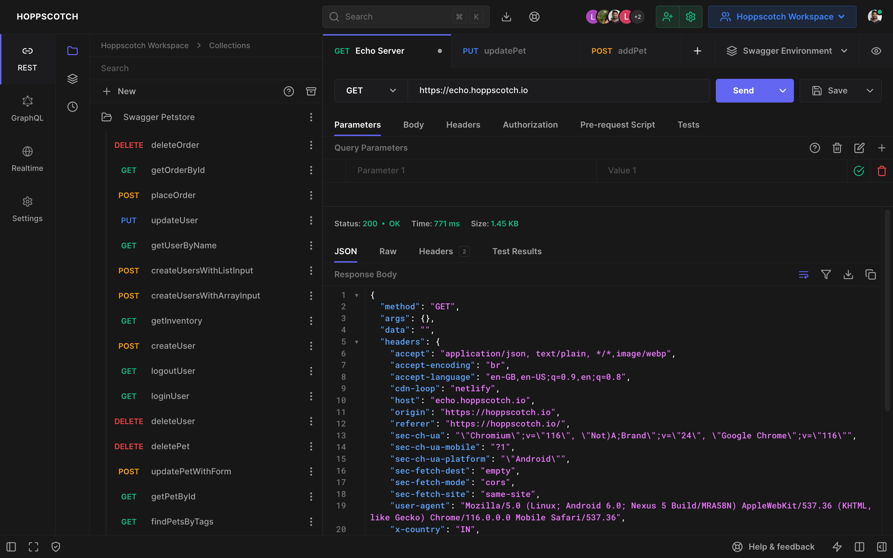

  
  <h3>
    <b>
      Hoppscotch
    </b>
  </h3>
  <b>
    开源 API 开发生态系统
  </b>
  

   

  

  

    
      由
      <a href="https://github.com/hoppscotch/hoppscotch/graphs/contributors">
        贡献者们
      </a>
      用 ❤︎ 构建
    
  

   
  

    <a href="https://hoppscotch.io">
      <picture>
        <source media="(prefers-color-scheme: dark)" srcset="./packages/hoppscotch-common/public/images/banner-dark.png">
        <source media="(prefers-color-scheme: light)" srcset="./packages/hoppscotch-common/public/images/banner-light.png">
        
      </picture>
    </a>
  

_我们强烈建议您查阅 [**Hoppscotch 文档**](https://docs.hoppscotch.io) 以了解更多关于该应用的信息。_

#### **支持**

  

### **功能特性**

❤️ **轻量级：** 采用极简 UI 设计。

⚡️ **快速：** 实时发送请求并获取响应。

🗄️ **HTTP 方法：** 请求方法定义了您请求执行的操作类型。

- `GET` - 请求获取资源信息
- `POST` - 服务器在数据库中创建新条目
- `PUT` - 更新现有资源
- `PATCH` - 与 `PUT` 非常相似，但对资源进行部分更新
- `DELETE` - 删除资源或相关组件
- `HEAD` - 获取与 GET 请求相同的响应头，但没有响应体
- `CONNECT` - 建立到由目标资源标识的服务器的隧道
- `OPTIONS` - 描述目标资源的通信选项
- `TRACE` - 沿着通往目标资源的路径执行消息回环测试
- `<custom>` - 一些 API 使用自定义请求方法，如 `LIST`。输入您的自定义方法。

🌈 **主题：** 可自定义的背景、前景和强调色组合 — [立即自定义](https://hoppscotch.io/settings)。

- 选择主题：系统偏好、浅色、深色和纯黑
- 选择强调色：绿色、青色、蓝色、靛蓝色、紫色、黄色、橙色、红色和粉色
- 无干扰的禅模式

_自定义主题与您的云端/本地会话同步。_

🔥 **PWA：** 在设备上安装为 [渐进式 Web 应用](https://web.dev/progressive-web-apps)。

- 通过 Service Workers 实现即时加载
- 离线支持
- 低内存和 CPU 占用
- 添加到主屏幕
- 桌面 PWA

🚀 **请求：** 立即从端点获取响应。

1. 选择 `方法`
2. 输入 `URL`
3. 发送

- 复制/分享公开的"分享链接"
- 为 10+ 种语言和框架生成/复制请求代码片段
- 导入 `cURL`
- 为请求添加标签

🔌 **WebSocket：** 在单个 TCP 连接上建立全双工通信通道。

📡 **服务器推送事件 (SSE)：** 通过 HTTP 连接从服务器接收更新流，无需轮询。

🌩 **Socket.IO：** 与 SocketIO 服务器发送和接收数据。

🦟 **MQTT：** 订阅和发布 MQTT Broker 的主题。

🔮 **GraphQL：** GraphQL 是一种用于 API 的查询语言，以及基于现有数据执行查询的运行时。

- 设置端点并获取模式
- 多列文档
- 设置自定义请求头
- 查询模式
- 获取查询响应

🔐 **授权：** 允许识别终端用户。

- 无
- Basic
- Bearer Token
- OAuth 2.0
- OIDC Access Token/PKCE

📢 **请求头：** 描述请求体的发送格式。

📫 **参数：** 使用请求参数设置模拟请求中的可变部分。

📃 **请求体：** 用于通过 REST API 发送和接收数据。

- 设置 `Content Type`
- FormData、JSON 等多种格式
- 在键值对和原始输入参数列表之间切换

📮 **响应：** 包含状态行、响应头和消息/响应体。

- 将响应复制到剪贴板
- 将响应下载为文件
- 查看响应头
- 查看原始和预览的 HTML、图片、JSON 和 XML 响应

⏰ **历史记录：** 请求条目与您的云端/本地会话存储同步。

📁 **集合：** 使用集合和文件夹整理您的 API 请求。一键即可复用。

- 无限集合、文件夹和请求
- 嵌套文件夹
- 导出和导入为文件或 GitHub Gist

_集合与您的云端/本地会话存储同步。_

📜 **前置脚本：** 与请求关联的代码片段，在请求发送前执行。

- 设置环境变量
- 在请求头中包含时间戳
- 在 URL 参数中发送随机字母数字字符串
- 任何 JavaScript 函数

👨‍👩‍👧‍👦 **团队：** 帮助您跨团队协作，更快地设计、开发和测试 API。

- 创建无限团队
- 创建无限共享集合
- 创建无限团队成员
- 基于角色的访问控制
- 云端同步
- 多设备支持

👥 **工作区：** 将您的个人和团队集合环境组织到工作区中。轻松切换工作区以管理多个项目。

- 创建无限工作区
- 在个人和团队工作区之间切换

⌨️ **键盘快捷键：** 为效率而优化。

> **[阅读我们的键盘快捷键文档](https://docs.hoppscotch.io/documentation/features/shortcuts)**

🌐 **代理：** 从设置中启用代理模式以访问被封锁的 API。

- 隐藏您的 IP 地址
- 修复 [`CORS`](https://developer.mozilla.org/en-US/docs/Web/HTTP/CORS)（跨域资源共享）问题
- 访问非 HTTPS（`http://`）端点的 API
- 使用您的代理 URL

_官方代理服务器由 Hoppscotch 托管 — **[GitHub](https://github.com/hoppscotch/proxyscotch)** — **[隐私政策](https://docs.hoppscotch.io/support/privacy)**。_

🌎 **国际化：** 以您的语言体验应用。

帮助我们翻译 Hoppscotch。请阅读 [`TRANSLATIONS`](TRANSLATIONS.md) 了解我们的 [`行为准则`](CODE_OF_CONDUCT.md) 以及提交 Pull Request 的流程。

☁️ **认证 + 同步：** 登录并实时同步您所有设备上的数据。

**登录方式：**

- GitHub
- Google
- Microsoft
- 电子邮件
- SSO（单点登录）[^EE]

**🔄 同步您的数据：** 在其他设备上接力继续任务。

- 工作区
- 历史记录
- 集合
- 环境变量
- 设置

✅ **后置测试：** 编写与请求关联的测试，在请求响应后执行。

- 检查状态码（整数）
- 过滤响应头
- 解析响应数据
- 设置环境变量
- 编写 JavaScript 代码

🌱 **环境变量：** 环境变量允许您在请求和脚本中存储和复用值。

- 无限环境和变量
- 通过前置脚本初始化
- 导出为 / 从 GitHub Gist 导入

  
<i>使用场景</i>

---

- 通过将值存储在变量中，您可以在请求部分中引用它
- 如果需要更新值，只需在一处更改即可
- 使用变量可以提高工作效率并最大限度地减少出错的可能性

---

🚚 **批量编辑：** 批量编辑键值对。

- 条目以换行符分隔
- 键和值以 `:` 分隔
- 在任何要添加但保持禁用的行前加 `#`

🎛️ **管理后台：** 管理您的团队并邀请成员。

- 数据洞察
- 管理用户
- 管理团队

📦 **附加组件：** Hoppscotch 的官方附加组件。

- **[Hoppscotch CLI](https://github.com/hoppscotch/hoppscotch/tree/main/packages/hoppscotch-cli)** - Hoppscotch 的命令行界面。
- **[代理](https://github.com/hoppscotch/proxyscotch)** - 为 Hoppscotch 创建的简单代理服务器。
- **[浏览器扩展](https://github.com/hoppscotch/hoppscotch-extension)** - 增强 Hoppscotch 体验的浏览器扩展。

  [ **Firefox**](https://addons.mozilla.org/en-US/firefox/addon/hoppscotch) &nbsp;|&nbsp; [ **Chrome**](https://chrome.google.com/webstore/detail/hoppscotch-extension-for-c/amknoiejhlmhancpahfcfcfhllgkpbld)

  > **扩展可以修复 `CORS` 问题。**

_附加组件在 **[Hoppscotch 组织](https://github.com/hoppscotch)** 下开发和维护。_

**有关功能的完整列表，请阅读我们的 [文档](https://docs.hoppscotch.io)。**

## **演示**

- 网页版：[hoppscotch.io](https://hoppscotch.io)
- Windows/Linux/macOS：[桌面应用](https://docs.hoppscotch.io/documentation/clients/desktop#download-hoppscotch-desktop-app)

## 使用方法

1. 在 URL 字段中提供您的 API 端点
2. 点击"发送"以模拟请求
3. 查看响应

## 开发

请按照我们的 [自托管文档](https://docs.hoppscotch.io/documentation/self-host/getting-started) 开始搭建开发环境。

## 贡献

请使用 [GitHub Flow](https://guides.github.com/introduction/flow) 进行贡献。创建分支、添加提交并 [提交 Pull Request](https://github.com/hoppscotch/hoppscotch/compare)。

请阅读 [`CONTRIBUTING`](CONTRIBUTING.md) 了解我们的 [`行为准则`](CODE_OF_CONDUCT.md) 以及提交 Pull Request 的流程。

## 持续集成

我们使用 [GitHub Actions](https://github.com/features/actions) 进行持续集成。查看我们的 [构建工作流](https://github.com/hoppscotch/hoppscotch/actions)。

## 更新日志

详见 [`CHANGELOG`](CHANGELOG.md) 文件。

## 作者

本项目的诞生归功于所有贡献者的集体努力 — [立即贡献](CONTRIBUTING.md)。

  

## 许可证

本项目基于 [MIT 许可证](https://opensource.org/licenses/MIT) — 详见 [`LICENSE`](LICENSE) 文件。

[^EE]: 企业版功能。[了解更多](https://docs.hoppscotch.io/documentation/self-host/getting-started)。
