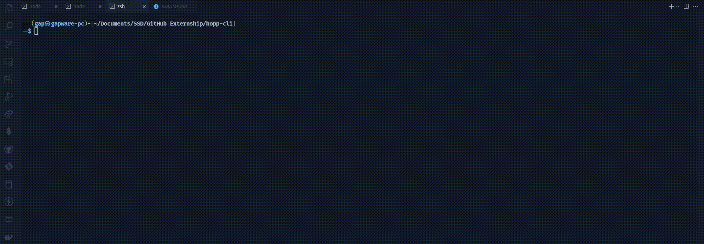

<div align="center">
    <h1><strong>Hoppscotch CLI</strong></h1>
</div>

<div align="center">
    <h2><strong>A CLI to run Hoppscotch test scripts in CI environments.</strong></h2>
</div>

## **Preview of the CLI:**

<div align="center">
    
</div>

## **Commands Available:**

```
Usage: hopp-cli [options or commands] arguments

Options:
  -v, --ver            see the current version of the CLI
  -c, --config <file>  path to a Hoppscotch collection.json file for CI testing
  -h, --help           display help for command

Commands:
  test                 interactive Hoppscotch testing through CLI
```

## **Command Descriptions:**

1. ### **`hopp-cli -v` / `hopp-cli --ver`**

   - Prints out the current version of the Hoppscotch CLI

2. ### **`hopp-cli -c <config>` / `hopp-cli --config <config>`**

   - Takes an absolute path of the Hoppscotch config JSON
   - Parses the collection JSON and executes each requests
   - Outputs the response of each request
   - (FUTURE SCOPE): Execute the pre-request and post-request scripts on each request

3. ### **`hopp-cli -h` / `hopp-cli --help`**

   - Displays the help text

4. ### **`hopp-cli test`**
   - Interactive CLI to accept Hoppscotch collection JSON path
   - Parses the collection JSON and executes each requests
   - Outputs the response of each request
   - (FUTURE SCOPE): Execute the pre-request and post-request scripts on each request

## **Installation:**

1. Clone the repository
2. `pnpm install`
3. `cd packages/hoppscotch-cli`
4. `pnpm run build`
5. `sudo pnpm link --global`
6. Test the installation by executing `hopp-cli`

## **Contributing:**

To get started contributing to the repository, please read **[CONTRIBUTING.md](./CONTRIBUTING.md)**
