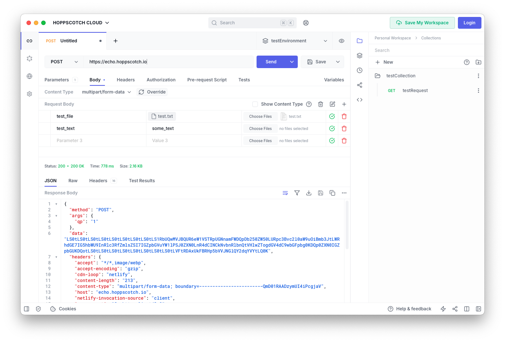
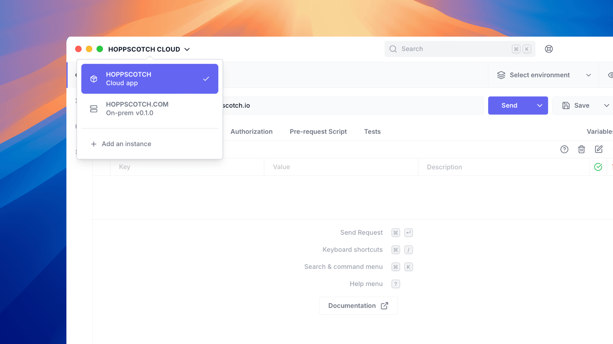

# Hoppscotch Desktop App <sup>ALPHA</sup>

<div align="center">
   
   <h1 align="center"><b>Hoppscotch Desktop</b></h1>
   <h2 align="center">
      <a href="https://hoppscotch.com/download">Download</a> |
      <a href="https://docs.hoppscotch.io/documentation/clients/desktop">Official Docs</a>
   </h2>
</div>

<br/>

#### Hoppscotch Desktop App is a cross-platform [Hoppscotch](https://hoppscotch.io) app built with [Tauri V2](https://v2.tauri.app/)



#### Now with the ability to connect to Self-Hosted instances



## Installation

1. [Download the latest version of Hoppscotch Desktop App](https://hoppscotch.com/download)
2. Open the downloaded file.
3. Follow the on-screen instructions to install Hoppscotch Desktop App.
4. Open Hoppscotch Desktop App.

## Access Options

### Hoppscotch Cloud Edition for Individuals

1. Open Hoppscotch Desktop App.
2. Click the Hoppscotch logo in the top-left corner.
3. Click "**HOPPSCOTCH CLOUD**".
4. Sign in with your Hoppscotch Cloud account to access your workspaces and collections.

### Self-Hosted Edition (Community and Enterprise)

> [!Note]
> To enable desktop app support for your self-hosted Hoppscotch instance, make sure to update the `WHITELISTED_ORIGINS` environment variable in your `.env` file with your deployment URL.
>
> e.g. to allow connection to `https://hoppscotch.mydomain.com` you need to add `app://hoppscotch_mydomain_com` (MacOS, Linux) and `http://app.hoppscotch_mydomain_com` (Windows) to the `WHITELISTED_ORIGINS` environment variable.
> ```bash
> WHITELISTED_ORIGINS=...existing_origins,app://hoppscotch_mydomain_com,http://app.hoppscotch_mydomain_com
> ```

To connect to your self-hosted (community or enterprise) instance:

1. Open Hoppscotch Desktop App.
2. Click the Hoppscotch logo in the top-left corner.
3. Click "**Add an instance**".
4. Enter the URL of your self-hosted Hoppscotch instance.
5. Click "**Connect**".

> [!Note]
> For docker setup, the desktop app uses a server at port `3200`, and it is part of the frontend container:
> 
> ```
> ❯ docker run -p 3000:3000 -p 3200:3200 hoppscotch/hoppscotch-frontend
> ```
> 
> Once the container is live, you can enter `[your-ip]:3200` or simply the base address of the instance if you are using [subpath access](https://docs.hoppscotch.io/guides/articles/self-host-hoppscotch-on-your-own-servers#4-subpath-access). 

## Building and Self-Hosting Hoppscotch Desktop

You can also build Hoppscotch Desktop locally to self-host with on-prem infra:

1. Install and generate the selfhost web app:
   ```bash
   cd ../hoppscotch-selfhost-web
   pnpm install
   pnpm generate
   ```
2. Build the `webapp-bundler`:
   ```bash
   cd crates/webapp-bundler
   cargo build --release
   ```
3. Bundle the web app:
   ```bash
   cd target/release
   ./webapp-bundler --input [path-to-dist-directory] --output [path-to-hoppscotch-desktop]/bundle.zip --manifest [path-to-hoppscotch-desktop]/manifest.json
   ```
4. Run the development server:
   ```bash
   cd hoppscotch-desktop
   pnpm tauri dev
   ```
   or the following for production build:
   ```bash
   cd src-tauri
   pnpm tauri dev
   ```

> [!Note]
> `[path-to-dist-directory]` should point to the `dist` directory created by the `pnpm generate` command in step 1.

## Minimum System Requirements

### Windows
- **OS Version**: Windows 10 1803+ or Windows 11
- **Architecture**: x64

### macOS
- **OS Version**: macOS 10.15 (Catalina) or later
- **Architecture**: Intel x64 or Apple Silicon (ARM64)

### Linux
- **Architecture**: x64
- **Recommended OS**: Ubuntu 24.04 or newer (or similar flavor of distros)
- **Minimum**: Systems with GLIBC 2.38+

#### Why Ubuntu 24.04-like flavors or newer?

Ubuntu 24.04-like flavors ships with the exact WebKit2GTK version (2.44.0-2) that is stable enough to correctly handle interaction between WebKit, UI libraries, Mesa drivers, and Wayland displays.[^1][^2][^3]

> [!IMPORTANT]
> There may be some display oddities on Wayland systems caused by the interaction between WebKit and the underlying graphics drivers.[^4][^5][^6]
>
> **Workaround**: 
> ```bash
> WEBKIT_DISABLE_COMPOSITING_MODE=1 hoppscotch
> # or
> WEBKIT_DISABLE_DMABUF_RENDERER=1 hoppscotch
> # or both together
> ```

### Misc.

- **Older distributions**: The AppImage requires GLIBC 2.38+ [^1][^7]
  - Users on older systems will see GLIBC version errors like "GLIBC_2.32' not found"[^8]
- **Tauri v2 dependency**: The desktop app requires libwebkit2gtk-4.1, which is only available by default in Ubuntu 22.04+ repositories[^9]
- **Build from source**: GitHub workflow for building from source[^10]

---

### Sources

[^1]: [WebKit version pinning and GLIBC explanation](https://github.com/hoppscotch/hoppscotch/issues/3543#issuecomment-2869628299) - Detailed explanation of why specific webkit2gtk 2.44.0-2 is used and GLIBC 2.38+ requirement

[^2]: [WebKit 2.44.0-2 selection rationale](https://github.com/hoppscotch/hoppscotch/issues/4880#issuecomment-2014063000) - Why this specific version provides the best balance for Wayland support

[^3]: [Ubuntu webkit2gtk package versions](https://packages.ubuntu.com/search?keywords=webkit2gtk&searchon=names) - Official Ubuntu package repositories showing version availability

[^4]: [EGL/Mesa/Wayland bug report](https://bugs.launchpad.net/ubuntu/+source/webkit2gtk/+bug/1966418) - Comprehensive bug report about webkit apps showing blank screens on Wayland

[^5]: [WebKit GTK Wayland compositing issue](https://bugs.webkit.org/show_bug.cgi?id=165246) - Upstream WebKit bug about compositing mode failures

[^6]: [Mesa issue with webkit2gtk](https://gitlab.freedesktop.org/mesa/mesa/-/issues/6236) - Mesa driver interaction with webkit2gtk causing EGL initialization failures

[^7]: [GLIBC compatibility matrix](https://github.com/hoppscotch/hoppscotch/issues/3543#issuecomment-1077225935) - User reports of specific GLIBC version errors

[^8]: [Specific GLIBC error examples](https://github.com/hoppscotch/hoppscotch/issues/3543#issuecomment-1329816314) - User reports showing exact GLIBC version error messages

[^9]: [Tauri v2 webkit requirements](https://github.com/tauri-apps/tauri/issues/8535#issuecomment-2162723242) - Tauri v2's dependency on libwebkit2gtk-4.1

[^10]: [Hoppscotch Desktop build workflow](https://github.com/hoppscotch/hoppscotch/blob/main/.github/workflows/build-hoppscotch-desktop.yml) - Official build workflow and instructions
