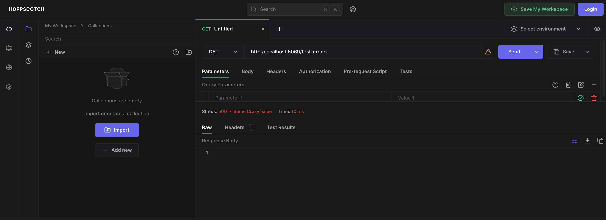
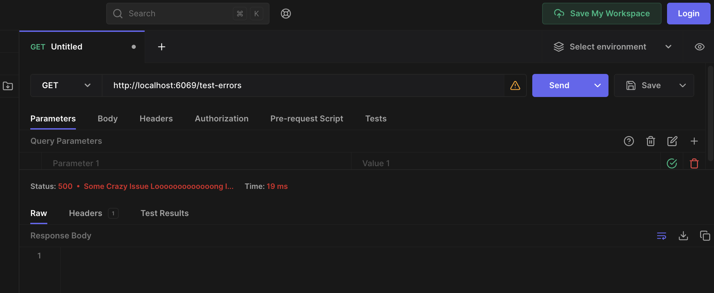

# Allow Custom Status Text for APIs
In reference to the issues: [#3458](https://github.com/hoppscotch/hoppscotch/issues/3458) this RFC proposes the following changes to allow status text to be displayed if it exists in the HTTP response.

## Proposed Changes

To `packages/hoppscotch-common/src/helpers/types/HoppRESTResponse.ts`
```typescript
// TO: packages/hoppscotch-common/src/helpers/types/HoppRESTResponse.ts
export type HoppRESTResponse =
  | { type: "loading"; req: HoppRESTRequest }
  | {
      type: "fail"
      headers: HoppRESTResponseHeader[]
      body: ArrayBuffer
      statusCode: number
      statusText: string // Unsure If I have to add this here as well because I could not find any implementation of this type.
      meta: {
        responseSize: number // in bytes
        responseDuration: number // in millis
      }

      req: HoppRESTRequest
    }
  | {
      type: "network_fail"
      error: unknown

      req: HoppRESTRequest
    }
  | {
      type: "script_fail"
      error: Error
    }
  | {
      type: "success"
      headers: HoppRESTResponseHeader[]
      body: ArrayBuffer
      statusCode: number
      statusText: string // Newly adding this prop to the HoppRESTResponse should help pass the required text
      meta: {
        responseSize: number
        responseDuration: number
      }
      req: HoppRESTRequest
    }
```
As you can see this should help us pass the statusText available in the Axios Response.

TO: `packages/hoppscotch-common/src/helpers/network.ts`
```typescript
function processResponse(
  res: NetworkResponse,
  req: EffectiveHoppRESTRequest,
  backupTimeStart: number,
  backupTimeEnd: number,
  successState: HoppRESTResponse["type"]
) {
  const contentLength = res.headers["content-length"]
    ? parseInt(res.headers["content-length"])
    : (res.data as ArrayBuffer).byteLength

  return <HoppRESTResponse>{
    type: successState,
    statusCode: res.status,
    statusText: res.statusText ?? '',
    body: res.data,
    headers: Object.keys(res.headers).map((x) => ({
      key: x,
      value: res.headers[x],
    })),
    meta: {
      responseSize: contentLength,
      responseDuration: backupTimeEnd - backupTimeStart,
    },
    req,
  }
}
```

TO: `packages/hoppscotch-common/src/helpers/utils/statusCodes.ts`
```typescript
export function getStatusCodeReasonPhrase(code: number, statusText?:string): string {
  if(statusText && statusText !== '') return statusText.trim().length > 35
      ? statusText.trim().substring(0, 35) + "..."
      : statusText.trim()
  return statusCodes[code] ?? "Unknown"
}
```

Post these updates I will also be updating the Tests.

I am also attaching the PR with the changes as they were pretty small to work on.



Post Your Go Ahead I'll delete this RFC folder and pass it as ready for Merge.
